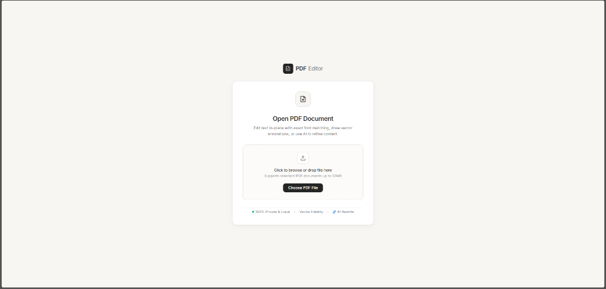
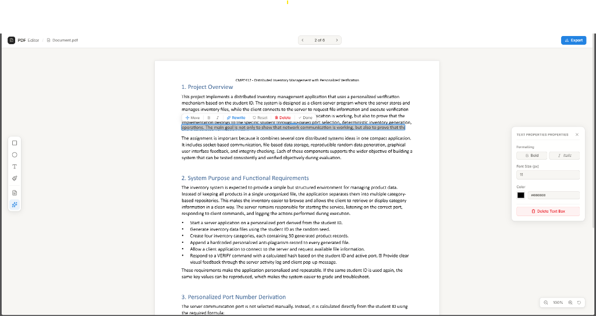

# PDF Editor

A minimalist, Notion-inspired PDF editor built with **React**, **TypeScript**, **PDF.js**, and **Fabric.js**. Edit document text in-place with exact typography matching, draw annotations with vector brushes, and export documents with zero loss in fidelity.

---

## 📸 Screenshots

### 1. Document Landing & File Ingestion


### 2. Workspace & In-Place Text Editing


---

## ✨ Features

- **🎨 Notion-Inspired Minimalism**:
  - Warm paper aesthetic (`#F7F6F3`), charcoal typography (`#37352F`), and crisp 1px borders.
  - Minimalist floating toolbars, micro-formatting popovers, and an inspector sidebar.

- **✏️ Sub-Pixel In-Place Text Editing**:
  - Click directly on any text line in the PDF to edit it in place.
  - Automatic detection of font family (Serif, Sans, Monospace), font size, weight, and style.
  - Interactive micro-toolbar for formatting: **Bold** (`Ctrl+B`), **Italic** (`Ctrl+I`), text reset, and deletion (whiteout mask).
  - Drag-and-drop handles to move text blocks anywhere on the page.

- **🖌️ Freehand Painter & Vector Drawing**:
  - Dual-layer Fabric.js canvas synchronized with the high-DPI PDF page viewport.
  - **Pen & Marker**: Presets for Fine (2px), Medium (4px), Thick (8px), and Marker (16px).
  - **Highlighter Mode**: Translucent highlighting for emphasizing key text.
  - **Stroke Eraser**: Click or drag over drawing strokes to remove them instantly while leaving PDF content untouched.
  - **Clear Page**: One-click action to remove all drawings on the current page.

- **📐 Shape Annotation**:
  - Add Rectangles and Circles with editable dimensions (width, height, diameter) and colors via the right properties panel.
  - Full keyboard deletion (`Delete` / `Backspace`).

- **⏳ Page Navigation & Loading States**:
  - Centered Notion-style loading spinner between page transitions.
  - Segmented top pagination pill with integrated loading indicator.

- **💾 Lossless Vector Export**:
  - Exports modified PDF documents embedding new text, whiteout overlays, and vector SVG drawings.
  - All annotations persist cleanly across page changes.

- **🔒 100% Private & Local**:
  - All document parsing, vector rendering, and annotation processing run directly in the browser.

---

## 🛠️ Tech Stack

- **Framework**: [React 19](https://react.dev/) + [TypeScript](https://www.typescriptlang.org/)
- **Build Tool**: [Vite](https://vite.dev/)
- **Styling**: [Tailwind CSS v4](https://tailwindcss.com/)
- **PDF Rendering**: [PDF.js (pdfjs-dist)](https://mozilla.github.io/pdf.js/)
- **Vector Canvas**: [Fabric.js v6](https://fabricjs.com/)
- **PDF Manipulation**: [pdf-lib](https://pdf-lib.js.org/)
- **Icons**: [Lucide React](https://lucide.dev/)

---

## 🚀 Getting Started

### 1. Installation

```bash
# Clone the repository
git clone https://github.com/UL2IMATE/pdf-editor.git
cd pdf-editor

# Install dependencies
npm install
```

### 2. Development Server

```bash
npm run dev
```

Open [http://localhost:5173](http://localhost:5173) in your browser.

### 3. Production Build

```bash
npm run build
npm run preview
```

---

## ⌨️ Keyboard Shortcuts

| Shortcut | Action |
| :--- | :--- |
| `Ctrl + B` / `⌘ + B` | Toggle **Bold** on selected text edit |
| `Ctrl + I` / `⌘ + I` | Toggle *Italic* on selected text edit |
| `Enter` / `Esc` | Commit inline text edits |
| `Delete` / `Backspace` | Delete active shape, stroke, or text box |

---

## 📄 License

MIT
