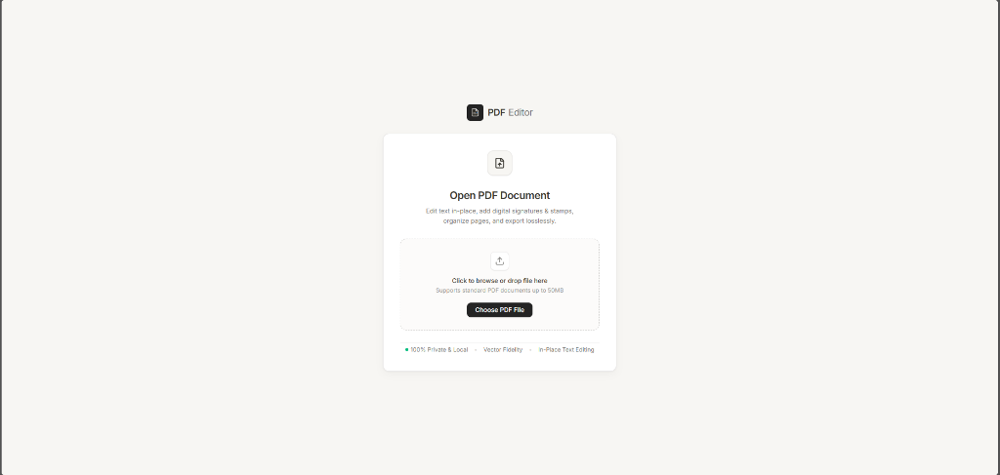
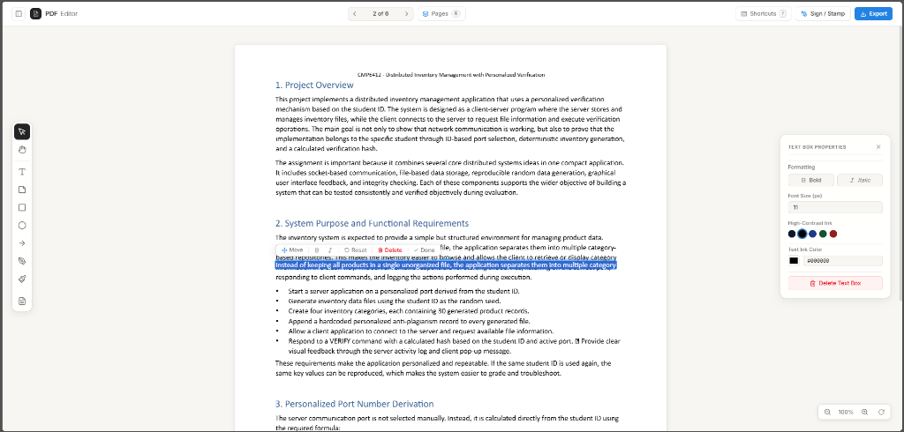

# PDF Editor

A minimalist, Notion-inspired full-stack PDF editor featuring in-place typography-matched text editing, dual-layer vector canvas with freehand brush and eraser, geometric shape annotations, and lossless PDF export.

---

## 📸 Screenshots

### 1. Document Landing & File Ingestion


### 2. Editor Workspace & In-Place Text Editing


---

## 📁 Repository Structure

This repository is organized as a unified monorepo containing both the frontend client and the backend processing service:

```text
pdf-editor/
├── frontend/                  # React 19 + TypeScript + Vite + Tailwind CSS
│   ├── src/
│   │   ├── components/        # Canvas, toolbars, properties inspector, dropzone
│   │   ├── services/          # Backend API client (extract-blocks & edits)
│   │   ├── utils/             # Lossless vector PDF export (pdf-lib & SVG stamping)
│   │   └── index.css          # Notion design system tokens
│   ├── public/                # Static assets & PDF.js web worker
│   ├── screenshots/           # UI preview screenshots
│   └── package.json           # Frontend dependencies & scripts
├── backend/                   # Node.js + Express + TypeScript service
│   ├── src/
│   │   ├── controllers/       # PDF controllers (extract-blocks & server-side edit)
│   │   ├── services/          # PDF text & document manipulation services
│   │   ├── middleware/        # Upload limits & payload validation
│   │   ├── routes/            # RESTful API endpoints
│   │   └── server.ts          # Server entry point (Port 5000)
│   └── package.json           # Backend dependencies & scripts
├── screenshots/               # Repository preview images
├── package.json               # Root workspace orchestrator
├── .gitignore                 # Unified ignore rules
└── README.md                  # Project documentation
```

---

## ✨ Features

- **🎨 Notion-Inspired Minimalism**:
  - Warm paper aesthetic (`#F7F6F3`), charcoal typography (`#37352F`), and crisp 1px borders.
  - Floating left toolbar, contextual floating micro-formatting popover, and collapsible right properties inspector.

- **✏️ Sub-Pixel In-Place Text Editing**:
  - Click directly on any text block in the PDF to edit it inline with exact font family, size, weight, and style matching.
  - Interactive micro-toolbar for formatting: **Bold** (`Ctrl+B`), **Italic** (`Ctrl+I`), original text reset, and deletion (whiteout mask).
  - Drag-and-drop handles to move edited text blocks anywhere on the page with automatic background whiteout mask.

- **🖌️ Dual-Layer Vector Canvas & Freehand Painter**:
  - Dual-layer Fabric.js canvas synchronized with the high-DPI PDF page viewport.
  - **Pen & Marker**: Presets for Fine (2px), Medium (4px), Thick (8px), and Marker (16px).
  - **Highlighter Mode**: Semi-transparent yellow highlighting for emphasizing document passages.
  - **Stroke Eraser**: Click or drag over vector strokes to remove them instantly without affecting underlying PDF text.
  - **Clear Page**: One-click action to remove all vector strokes on the current page.

- **📐 Geometric Shape Annotations**:
  - Add Rectangles and Circles with custom fill and stroke colors.
  - Adjust width, height, and stroke properties in real time using the right inspector panel.
  - Keyboard deletion (`Delete` / `Backspace`).

- **⏳ Page Navigation & Loading States**:
  - Centered Notion-style loading spinner between page transitions.
  - Segmented top pagination pill with integrated loading indicator and zoom reset controls.

- **💾 Lossless Vector Export**:
  - Client-side and server-side PDF generation embedding new text, whiteout overlays, and vector SVG drawings with zero quality degradation.

- **🔒 100% Private & Local-First**:
  - Direct browser execution with optional backend services for server-assisted document block extraction and batch editing.

---

## 🛠️ Tech Stack

| Layer | Technologies |
| :--- | :--- |
| **Frontend** | React 19, TypeScript, Vite, Tailwind CSS v4, Fabric.js v7, PDF.js (pdfjs-dist), pdf-lib, Lucide React |
| **Backend** | Node.js, Express 5, TypeScript, tsx, Multer, pdf-lib, pdfjs-dist, Zod |
| **Styling** | Tailwind CSS v4, Notion Design Tokens (`#F7F6F3`, `#37352F`, `#2383E2`) |

---

## 🔌 Backend API Endpoints

The backend runs on `http://localhost:5000` and provides the following RESTful services:

| Method | Endpoint | Description |
| :--- | :--- | :--- |
| `POST` | `/pdf/upload` | Validates and accepts PDF uploads (up to 20MB). |
| `POST` | `/pdf/extract-blocks` | Parses PDF documents and extracts positional text blocks with typography metadata. |
| `POST` | `/pdf/edit` | Applies server-side text edits, whiteouts, and stamps onto the target PDF. |

---

## 🚀 Getting Started

### 1. Prerequisites
- **Node.js**: v20+ recommended
- **npm**: v10+

### 2. Installation

Clone the repository and install all dependencies:

```bash
# Clone the repository
git clone https://github.com/UL2IMATE/pdf-editor.git
cd pdf-editor

# Install dependencies across all workspaces
npm run install:all
```

### 3. Running in Development

Run both the frontend and backend concurrently with a single command:

```bash
npm run dev
```

Or run them individually in separate terminals:

```bash
# Terminal 1 - Start the Frontend (http://localhost:5173)
npm run frontend:dev

# Terminal 2 - Start the Backend (http://localhost:5000)
npm run backend:dev
```

### 4. Production Build

To compile both frontend and backend for production:

```bash
npm run build
```

---

## ⌨️ Keyboard Shortcuts

| Shortcut | Action |
| :--- | :--- |
| `Ctrl + B` / `⌘ + B` | Toggle **Bold** on selected text edit |
| `Ctrl + I` / `⌘ + I` | Toggle *Italic* on selected text edit |
| `Enter` / `Esc` | Commit inline text edits |
| `Delete` / `Backspace` | Delete selected shape, drawing stroke, or text box |

---

## 📄 License

MIT